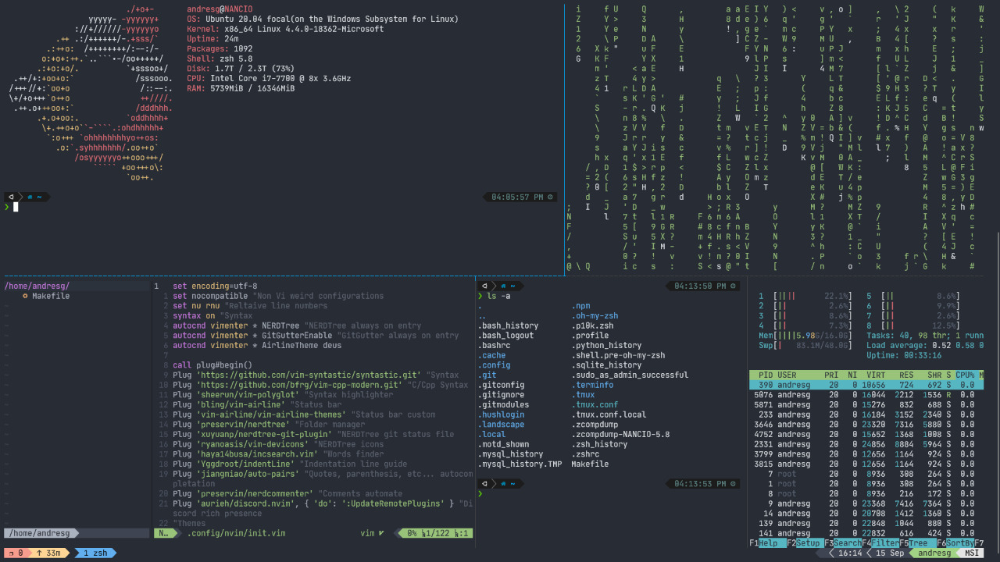

# dotfiles

## To install in Windows

Before install it, you need to have installed [cargo](https://doc.rust-lang.org/cargo/getting-started/installation.html) and added in your path.

```powershell -ExecutionPolicy ByPass -File windows_installer.ps1```

## Screenshot


## To install in Linux

```./linux_installer.sh```

## Linux Screen


