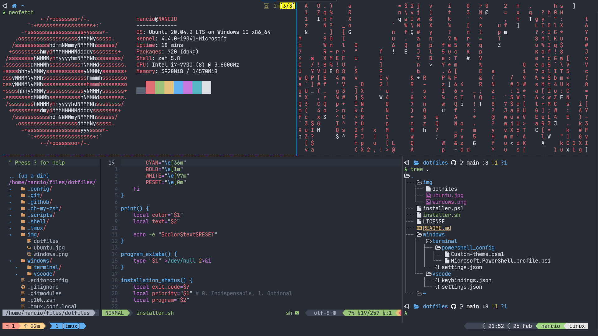
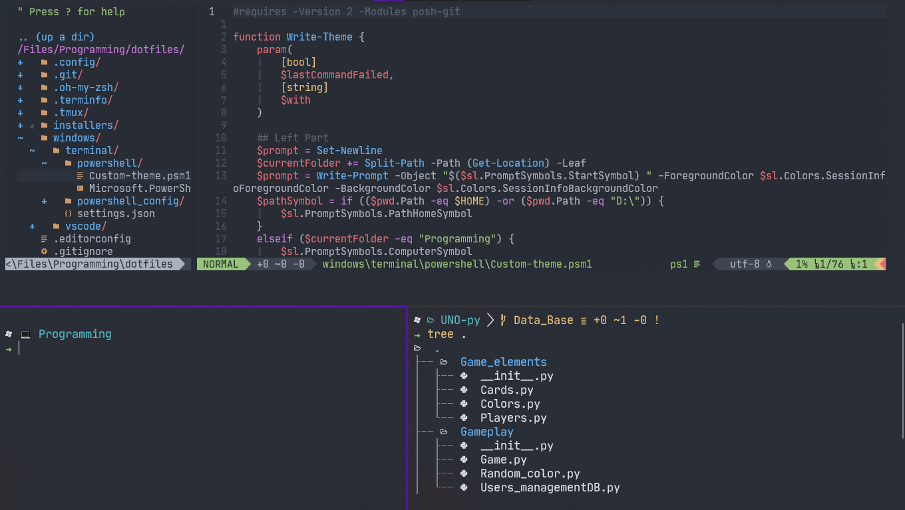

# dotfiles

My personal dotfiles

## To install in Linux (zsh)

clone the repository

```bash
git clone --depth 1 https://github.com/afgalvan/dotfiles.git
```

Go to the directory

```bash
cd dotfiles
```

Execute the installer

```bash
./install.sh
```

## Linux Screen



---

## To install in Windows (powershell)

**Before start...**

- Run powershell/windows terminal as administrator.

- You'll need [cargo](https://doc.rust-lang.org/cargo/getting-started/installation.html) installed in your machine and added in your path.

- Ensure that VS 2013, 2015, 2017 or 2019 was installed with the [Visual C++](https://support.microsoft.com/en-us/help/2977003/the-latest-supported-visual-c-downloads) option.

clone the repository

```bash
git clone --depth 1 https://github.com/afgalvan/dotfiles.git
```

Go to the directory

```bash
cd dotfiles
```

Execute the installer

```bash
powershell -ExecutionPolicy ByPass -File windows_installer.ps1
```

## Windows Screen


